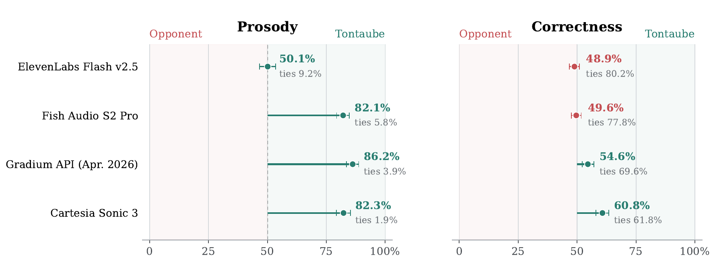

<p align="center">
  
</p>

<h1 align="center">TontaubeV1</h1>

TontaubeV1 is a multilingual text-to-speech model by Craitech. It is designed
for expressive voice cloning, long-form speech, and low-latency streaming, with
first-class support for English and German and additional support for Spanish,
French, Italian, Dutch, and Portuguese.

This repository contains the vLLM inference server. The model weights are
distributed separately. The four Tontaube codebook models are released
together. All enabled models are downloaded from their original Hugging Face
repositories on first use and reused from local caches on subsequent starts.

[Model weights](https://huggingface.co/TontaubeAI/TontaubeV1) ·
[Technical report](https://tontaube.ai/papers/tontaube-v1-technical-report.pdf) ·
[Try TontaubeV1 online](https://tontaube.ai/playground)

## Quick start

The shortest supported path requires Linux, an NVIDIA GPU and driver,
[`uv`](https://docs.astral.sh/uv/getting-started/installation/), FFmpeg, and the
Opus runtime. Clone the release and start the server:

```bash
git clone --branch v1.0.0 --depth 1 https://github.com/craitech/tontaube.git
cd tontaube
uv run --python 3.12 --frozen tontaube serve
```

`uv` creates the environment and installs the locked dependencies. On first
startup, Tontaube downloads all enabled models into local caches; later starts
reuse them. The API is available at `http://127.0.0.1:8080` after model loading
finishes. Check readiness from another terminal with:

```bash
curl --fail http://127.0.0.1:8080/readyz
```

Generate a WAV with the bundled Miles voice from another terminal:

```bash
curl --silent --show-error --fail http://127.0.0.1:8080/predict \
  -H 'content-type: application/json' \
  -d '{"text":"Welcome to Tontaube.","language":"english","tag":"conversational","format":"wav"}' \
| python3 -c 'import base64,json,sys; sys.stdout.buffer.write(base64.b64decode(json.load(sys.stdin)["audio_b64"]))' \
> welcome.wav
```

Clone a voice from a local audio file by sending it with the request. Use about
5–60 seconds of clean, single-speaker speech; longer references generally give
stronger conditioning, up to the one-minute prompt cap.

```bash
VOICE_FILE=/path/to/reference.wav
python3 -c 'import base64,json,sys; print(json.dumps({"text":"This voice was cloned from a local reference.","language":"english","tag":"conversational","voice_audio_b64":base64.b64encode(open(sys.argv[1],"rb").read()).decode(),"format":"wav"}))' "$VOICE_FILE" \
| curl --silent --show-error --fail http://127.0.0.1:8080/predict \
  -H 'content-type: application/json' \
  --data-binary @- \
| python3 -c 'import base64,json,sys; sys.stdout.buffer.write(base64.b64decode(json.load(sys.stdin)["audio_b64"]))' \
> cloned.wav
```

English text verbalization is optional and disabled by default. To load it,
start the server with `ENABLE_VERBALIZATION=1`; requests that should use it must
also send `"use_verbalization": true`. The verbalizer uses substantial
additional VRAM (about 4.8–5.5 GiB with the bundled capacity profiles), so
leave it disabled when written and spoken forms are already identical.

### Browser interface

With the API still running, start the optional UI in a second terminal:

```bash
uv run tontaube ui
```

Open `http://127.0.0.1:3000/`. It targets the local API by default, while its
**Server URL** field can point to a remote Tontaube server. The UI and inference
API are separate processes and can be started independently. A machine hosting
only the UI can use `python3 -m app.ui_server` without installing the GPU
environment. A remote API must allow the UI's exact origin through
`TTS_CORS_ORIGINS`.

The UI supports bundled voice selection, local voice-reference uploads,
sampling and acoustic controls, WAV/MP3/Opus responses, MP3 streaming, instant
playback, and downloads. It reads its own `voices/` directory and uploads the
selected WAV with each request, so a remote inference server does not need the
sample files. References live together in `voices/samples/`; optional language
and style metadata in `voices/manifest.json` controls language filtering and
groups the voice menu by style. Voices without a declared language appear for
every language, while voices without a declared style remain ungrouped. A badge
also shows the selected voice's style without changing the independently
selected synthesis style.

## Installation details

### Requirements

The supported reference setup is Linux with an NVIDIA GPU. Python 3.12 is the
reference interpreter. On Debian or Ubuntu, install the native audio packages
with:

```bash
sudo apt-get update
sudo apt-get install -y ffmpeg libopus0
```

Native Windows, macOS, CPU-only inference, and non-NVIDIA accelerators are not
supported by this vLLM server. Windows users can use a CUDA-enabled WSL2 Linux
environment. Use an NVIDIA GPU with at least 24 GiB of VRAM for the `low-vram`
or default `balanced` profile, and at least 32 GiB for `high-throughput`. Select
the lower-capacity profile with:

```bash
TTS_CAPACITY_PROFILE=low-vram uv run tontaube serve
```

These are practical release targets rather than hard hardware checks. The
per-engine GiB budgets can be tuned with `GPU_MEMORY_GIB_PER_CB` and
`VERBALIZATION_GPU_MEMORY_GIB`; leave enough unassigned VRAM for DualCodec,
VibeVoice, CUDA, and request-time tensors.

The first clean-cache startup may use more memory while vLLM compiles and
caches kernels. If that cold start runs out of memory, retrying once may succeed
because the follow-up start can reuse the newly created caches. A deployment
that must start reliably from a clean cache should instead lower its GiB
budgets and validate them on the target GPU.

The application pins the Tontaube weights and upstream model revisions for
release `v1.0.0`. For a later release, use its matching source tag; do not mix
model bundles and inference code from different releases. While the Tontaube
repositories are private or gated, provide a read-only `HF_TOKEN`.

The English verbalizer is downloaded only with `ENABLE_VERBALIZATION=1`.
VibeVoice is enabled by default; set `ENABLE_VIBEVOICE=0` to avoid downloading
and loading it. Without VibeVoice, non-streaming requests use raw DualCodec
output and the streaming routes are unavailable.

`tontaube serve` runs model preflight automatically before CUDA initialization.
Run `uv run tontaube preflight` separately only to diagnose model resolution
without starting the server.

### Explicit environment setup

The quick-start command handles environment creation automatically. To prepare
the environment separately instead, run:

```bash
uv sync --frozen --python 3.12
uv run tontaube serve
```

Do not replace `uv sync --frozen` with an unconstrained `pip install`. A stale
protobuf upper bound published by a transitive DualCodec dependency conflicts
with vLLM's current protobuf requirement; the repository contains the tested,
narrow override and lock file. Use the dedicated pip procedure below instead.

### pip

The checked-in `requirements-pip.lock` contains the same resolved environment
as `uv.lock`, including hashes. Install every locked dependency without
re-resolving upstream metadata, then install Tontaube itself:

```bash
python3.12 -m venv .venv
source .venv/bin/activate
python -m pip install --no-deps --require-hashes -r requirements-pip.lock
python -m pip install --no-deps --no-build-isolation .
tontaube serve
```

`--no-deps` is intentional here: the complete dependency set is already in the
lock file, and resolving it again would reintroduce AudioTools' obsolete
protobuf constraint. Regenerate `requirements-pip.lock` from `uv.lock` for each
release rather than editing it manually.

### Docker

Docker is available for deployments that want the CUDA, PyTorch, and vLLM
stack encapsulated in an image. Install Docker Engine and the NVIDIA Container
Toolkit, then build and run:

```bash
docker build -t tontaube-v1:1.0.0 .

docker run --rm --gpus all --ipc=host \
  -p 127.0.0.1:8080:8080 \
  -v tontaube-hf-cache:/root/.cache/huggingface \
  -v tontaube-cache:/root/.cache/tontaube \
  tontaube-v1:1.0.0
```

The named volumes preserve downloaded models and the prepared VibeVoice
acoustic component across container runs. Pass `-e HF_TOKEN` while the
Tontaube model repositories are private or gated.

## Highlights

- Synthesis with bundled voices and zero-shot cloning from an audio reference
- `audiobook`, `conversational`, and `agentic` speaking styles
- Long-form generation with boundary-aware text and audio chunking
- Low-latency MP3 and Opus streaming
- Character-level text tokenization and multilingual language conditioning
- Four codebook models served by vLLM in one inference process
- Optional English text verbalization, disabled by default

## Examples

These MP3 samples were normalized to a consistent speech listening level.

### Audiobook

**English 1**

<audio controls preload="none" src="assets/showcase/english-audiobook-01.mp3"></audio>

[Download MP3](assets/showcase/english-audiobook-01.mp3)

**English 2**

<audio controls preload="none" src="assets/showcase/english-audiobook-02.mp3"></audio>

[Download MP3](assets/showcase/english-audiobook-02.mp3)

**English 3**

<audio controls preload="none" src="assets/showcase/english-audiobook-03.mp3"></audio>

[Download MP3](assets/showcase/english-audiobook-03.mp3)

**German 1**

<audio controls preload="none" src="assets/showcase/german-audiobook-01.mp3"></audio>

[Download MP3](assets/showcase/german-audiobook-01.mp3)

### Agentic

**English 1**

<audio controls preload="none" src="assets/showcase/english-agentic-01.mp3"></audio>

[Download MP3](assets/showcase/english-agentic-01.mp3)

**English 2**

<audio controls preload="none" src="assets/showcase/english-agentic-02.mp3"></audio>

[Download MP3](assets/showcase/english-agentic-02.mp3)

**English 3**

<audio controls preload="none" src="assets/showcase/english-agentic-03.mp3"></audio>

[Download MP3](assets/showcase/english-agentic-03.mp3)

## How it works

TontaubeV1 represents speech with four DualCodec codebooks at 12.5 Hz. CB0
predicts semantic audio tokens autoregressively. CB1, CB2, and CB3 predict the
remaining acoustic codebooks from the completed lower-codebook rows. Acoustic
chunks are independent of preceding acoustic chunks and can therefore be
generated in parallel without accumulating voice drift across a long text.

CB0 is based on Qwen3-1.7B; CB1-CB3 are based on Qwen3-0.6B. Each stage uses a
Tontaube audio-token output head. DualCodec supplies the discrete speech
representation, while a reduced
VibeVoice acoustic encoder/decoder is used for output re-encoding and streaming
decode. The optional verbalizer is a separately trained model that converts
written English into a more suitable spoken form before synthesis.

Text is tokenized primarily at the character level. Explicit text and audio
boundaries, together with shared non-linear position IDs across codebooks, keep
the modalities aligned while allowing long texts to continue without audible
cuts. The complete serialization and position-ID scheme is described in the
[technical report](https://tontaube.ai/papers/tontaube-v1-technical-report.pdf).

### Model architecture

| Predictor | Role | Transformer blocks | Width | Stored parameters |
|---|---|---:|---:|---:|
| CB0 | Semantic audio and duration | 28 | 2,048 | 1,829,116,930 |
| CB1 | Acoustic refinement | 16 | 1,024 | 448,960,512 |
| CB2 | Acoustic refinement | 8 | 1,024 | 327,307,264 |
| CB3 | Acoustic refinement | 4 | 1,024 | 268,577,792 |
| **Total** |  | **56** |  | **2,873,962,498** |

### Training

All four predictors were trained exclusively with supervised fine-tuning on
approximately 200,000 hours of paired speech and text across seven languages,
predominantly from public-domain audiobook recordings and openly released
speech corpora.

### Serving performance

With weights resident on one NVIDIA GeForce RTX 5090 and the process warmed,
the streaming path reaches approximately 200 ms to first encoded audio. In
separate non-streaming measurements, end-to-end real-time factor (RTF) is 0.08
for one input and aggregate RTF is 0.02 across eight concurrent inputs. Startup,
model loading, and network latency are excluded.

### Evaluation

The LLM-as-a-judge pairwise audiobook-reading benchmark contains 400 fixed
English passages of 250--500 characters. For each passage, Gemini 3.1 Pro
Preview judges the same output pair twice, once in each presentation order, on
prosody and word-by-word correctness. A TontaubeV1 preference, tie, or
comparator preference scores 1, 0.5, or 0; the figure reports the mean over all
800 order-balanced judgments. A score of 50% denotes parity. Whiskers show 95%
passage-cluster bootstrap intervals; labels beneath the points give tie rates
across individual judge calls.

<p align="center">
  
</p>

<details>
<summary>Exact preference scores</summary>

| Comparator | Prosody preference | Correctness preference |
|---|---:|---:|
| ElevenLabs Flash v2.5 | 50.1% | 48.9% |
| Fish Audio S2 Pro | 82.1% | 49.6% |
| Gradium API, April 2026 | 86.2% | 54.6% |
| Cartesia Sonic 3 | 82.3% | 60.8% |

</details>

TontaubeV1 uses semantic sampling temperature `0.55` and acoustic temperature
zero in these comparisons. Each waveform is independently normalized to an
average level of -20 dBFS before judging. Fish Audio uses the same frozen
cloning reference as TontaubeV1. ElevenLabs, Gradium, and Cartesia instead use
fixed provider voices while TontaubeV1 uses the cloning reference. Although
voice identity and timbre are excluded from the rubric, prosody is not fully
separable from the reference; this asymmetry may favor TontaubeV1 in those
three comparisons.

On the 1,088 English zero-shot examples of the Seed-TTS evaluation set,
TontaubeV1 obtains 1.66% mean utterance-level word error rate using Whisper
large-v3 transcription at semantic sampling temperature `0.6`.

These automated evaluations measure English reading prosody and text
correctness. They do not establish voice similarity, overall sound quality,
multilingual quality, long-form continuity, or streaming quality. The
[technical report](https://tontaube.ai/papers/tontaube-v1-technical-report.pdf)
documents the full methodology, judge instructions, and further limitations.

## Model sources and runtime assets

By default, CB0--CB3, DualCodec, W2V-BERT, and the optional verbalizer and
VibeVoice source weights are resolved with Hugging Face Hub and cached under
its configured cache directory. The reduced VibeVoice acoustic model produced
from the pinned upstream snapshot is cached separately under
`~/.cache/tontaube`.

Set `CB0_MODEL_PATH`, `CB1_MODEL_PATH`, `CB2_MODEL_PATH`, or `CB3_MODEL_PATH`
to override individual codebooks with local directories. Setting `MODEL_PATH`
uses `<MODEL_PATH>/cb0` through `<MODEL_PATH>/cb3` for all codebooks without
changing where the upstream runtime models resolve. DualCodec, W2V-BERT, and
the prepared VibeVoice acoustic model each have an independent local-path
override. Repository and revision variables provide the corresponding remote
overrides.

`tontaube preflight` downloads and prepares enabled generation models, then validates all
required files before GPU initialization. It does not download VibeVoice or the
verbalizer when the corresponding feature is disabled. MossFormer2 is loaded
separately on the first non-streaming request that enables it.
The interactive OpenAPI documentation is available at
`http://127.0.0.1:8080/docs` after startup.

## Generate speech

`POST /predict` returns JSON containing base64-encoded audio. This example
writes the generated WAV to `tontaube.wav`:

```bash
curl --silent http://127.0.0.1:8080/predict \
  -H 'content-type: application/json' \
  -d '{
    "text": "Welcome to Tontaube.",
    "language": "english",
    "tag": "conversational",
    "temperature": 0.8,
    "format": "wav"
  }' \
| python3 -c 'import base64,json,sys; sys.stdout.buffer.write(base64.b64decode(json.load(sys.stdin)["audio_b64"]))' \
> tontaube.wav
```

The sampling-temperature default is `0.8`. A lower value such as `0.6` favors
correctness; values near `1.0` can produce more natural and expressive results.

For voice cloning, provide one of:

- `voice_audio_b64`: base64-encoded reference audio in any FFmpeg-supported format
- `voice_tokens`: precomputed semantic and acoustic prompt-token rows
- `voice_path`: an audio path inside the inference server's configured `VOICE_PATH`

When no voice source is supplied, the server uses the bundled Miles reference.
`prompt_max_tokens` can cap CB0 at 1--750 voice-prompt tokens; the later
codebooks apply their own smaller caps. Reference audio should contain clean
speech from one speaker.

Audio is synthesized at 24 kHz. By default, non-streaming `/predict` requests
trim quiet edges to approximately 250 ms of padding, shorten quiet pauses
longer than 2.5 seconds with a crossfade, and return 48 kHz audio using hybrid
MossFormer2_SR_48K enhancement. The hybrid retains the source's low-frequency
band and adds reconstructed high frequencies, using 4-second windows with
1-second overlap. Set `trim_silence_padding_ms: null` to disable edge trimming,
or `mossformer2_postprocess: false` to disable both enhancement and pause
shortening. Disable both to keep the original duration and 24 kHz waveform
before output encoding. Ogg/Opus files always use a 48 kHz playback clock.
The enhancer's approximately 420 MiB of weights are downloaded to the standard
Hugging Face cache on first use. Its CUDA weights and working memory are extra
to the codebook budgets; allow GPU headroom and expect a slower first request.

For server-sent MP3 chunks, send the request to `POST /stream`.
`WS /ws/stream` returns framed Opus audio from the 24 kHz synthesis stream.
Streaming does not apply edge trimming, pause shortening, or MossFormer2;
omit `mossformer2_postprocess` or set it to `false` for streaming.
Streaming always uses VibeVoice. The `bitrate` and `priority` fields apply to
every streaming route; `vllm_priority` is limited to non-streaming `/predict`
calls. An explicit
`format` must match the transport (`mp3` for SSE, `opus` for WebSocket), or it
may be omitted. `max_new_tokens` is the total per-chunk CB0 budget, including
the initial silence token and any early streaming prefix, and accepts 50–400.
`streaming_initial_seconds` controls the first buffered audio chunk. It defaults
to 2.8 seconds and accepts 0.4–6.0 seconds in 0.4-second increments. Increasing
it raises time to first audio but gives playback more headroom; if a custom
`max_new_tokens` value is too small for it, the request is rejected explicitly.

## Configuration

The main runtime settings are environment variables:

| Variable | Purpose |
|---|---|
| `TTS_MODEL_REPO_ID` | HF repository containing `cb0/` through `cb3/`; defaults to `TontaubeAI/TontaubeV1` |
| `TTS_MODEL_REVISION` | HF model revision; defaults to `v1.0.0` |
| `CB0_MODEL_PATH` ... `CB3_MODEL_PATH` | Optional per-codebook local-directory overrides |
| `MODEL_PATH` | Optional local root containing `cb0/` through `cb3/` |
| `DUALCODEC_MODEL_PATH` | Optional local DualCodec snapshot override |
| `DUALCODEC_MODEL_REPO_ID`, `DUALCODEC_MODEL_REVISION` | Optional DualCodec Hub source overrides |
| `W2VBERT_MODEL_PATH` | Optional local W2V-BERT model override |
| `W2VBERT_MODEL_REPO_ID`, `W2VBERT_MODEL_REVISION` | Optional W2V-BERT Hub source overrides |
| `VIBEVOICE_MODEL_PATH` | Optional local prepared VibeVoice acoustic-model override |
| `VIBEVOICE_MODEL_REPO_ID`, `VIBEVOICE_MODEL_REVISION` | Optional VibeVoice Hub source overrides |
| `MOSSFORMER2_SR_MODEL_PATH` | Optional local directory containing the two MossFormer2_SR_48K checkpoints |
| `MOSSFORMER2_SR_REPO_ID`, `MOSSFORMER2_SR_REVISION` | Optional MossFormer2_SR_48K Hub source overrides |
| `TONTAUBE_CACHE_DIR` | Cache for derived Tontaube runtime artifacts; defaults to `~/.cache/tontaube` |
| `VOICE_PATH` | Inference-server folder used for server-side `voice_path` requests and relative `DEFAULT_VOICE` overrides |
| `DEFAULT_VOICE` | Voice used when a request supplies none; defaults to bundled `samples/Miles.wav`, or accepts a path relative to `VOICE_PATH` or an absolute path |
| `REQUIRE_API_KEY` | Require an `x-api-key` header; defaults to `0` |
| `TTS_API_KEY` | Shared secret used when authentication is enabled |
| `TTS_CORS_ORIGINS` | Comma-separated browser origins allowed to call the API; defaults to the local UI on port 3000 |
| `ENABLE_STREAMING` | Enable SSE and WebSocket routes; defaults to `1` |
| `ENABLE_VIBEVOICE` | Load VibeVoice for output re-encoding and streaming; defaults to `1` |
| `TTS_UI_HOST` | Bind address for the standalone UI-only server; defaults to `127.0.0.1` |
| `TTS_UI_PORT` | Port for the standalone UI-only server; defaults to `3000` |
| `TTS_UI_VOICE_PATH` | Local sample-voice root served by the UI; defaults to the repository's `voices/` folder |
| `TTS_HOST` | HTTP bind address; defaults to `127.0.0.1` (`0.0.0.0` in Docker) |
| `TTS_PORT` | HTTP port; defaults to `8080` (`PORT` remains a fallback) |
| `TTS_LOG_LEVEL` | Runtime log level; defaults to `INFO`, use `DEBUG` for token and decoding diagnostics |
| `ENABLE_VERBALIZATION` | Load the optional English verbalizer; defaults to `0` |
| `VERBALIZATION_MODEL_REPO_ID` | HF verbalizer repository; defaults to `TontaubeAI/TontaubeV1-Verbalizer` |
| `VERBALIZATION_MODEL_REVISION` | HF verbalizer revision; defaults to `v1.0.0` |
| `VERBALIZATION_MODEL_PATH` | Optional local verbalizer-directory override |
| `VERBALIZATION_GPU_MEMORY_GIB` | Verbalizer vLLM memory budget; defaults by profile to `4.8`, `5.0`, or `5.5` GiB |
| `VERBALIZATION_MAX_NUM_SEQS` | Optional verbalizer concurrency override |
| `TTS_CAPACITY_PROFILE` | `low-vram`, `balanced` (default), or `high-throughput` |
| `GPU_MEMORY_GIB_PER_CB` | Four comma-separated vLLM memory budgets |
| `MAX_MODEL_LEN_PER_CB` | Four comma-separated context limits |
| `MAX_NUM_SEQS_PER_CB` | Four comma-separated active-sequence limits |
| `MAX_NUM_BATCHED_TOKENS_PER_CB` | Four comma-separated scheduler token budgets |
| `MAX_INFLIGHT_REQUESTS` | End-to-end request limit; defaults to twice the CB0 active-sequence limit |

To enable API-key authentication, provide both settings:

```bash
docker run --rm --gpus all --ipc=host \
  -p 127.0.0.1:8080:8080 \
  -v /absolute/path/to/tontaube-v1-models:/srv/models:ro \
  -e MODEL_PATH=/srv/models \
  -e REQUIRE_API_KEY=1 \
  -e TTS_API_KEY="replace-with-a-secret" \
  tontaube-v1:1.0.0
```

To enable the verbalizer, set `ENABLE_VERBALIZATION=1`. It must resolve and load
successfully at startup, and individual requests must also set
`"use_verbalization": true`. Such a request returns an explicit error when the
verbalizer is unavailable or the requested language is not English. When
verbalization is disabled, the model is not loaded.
Its active-sequence limit is 4 for `low-vram`, 10 for `balanced`, and 16 for
`high-throughput`.

### Capacity tuning

All per-codebook variables are ordered `cb0,cb1,cb2,cb3`. Select a profile with
`TTS_CAPACITY_PROFILE`; `balanced` is the conservative release default:

| Profile | Active sequences (CB0--CB3) | End-to-end requests | GPU memory in GiB (CB0--CB3) | Batched tokens (CB0--CB3) |
|---|---|---|---|---|
| `low-vram` | 1, 4, 4, 4 | 2 | 4.500, 1.860, 1.420, 1.220 | 2,500, 8,000, 9,600, 12,000 |
| `balanced` | 3, 8, 8, 8 | 6 | 4.900, 2.470, 1.920, 1.590 | 7,500, 16,000, 19,200, 24,000 |
| `high-throughput` | 8, 20, 20, 20 | 16 | 6.954, 5.204, 3.728, 3.250 | 20,000, 40,000, 48,000, 60,000 |

The budgets aim to retain request-time and compilation headroom. A clean-cache
low-VRAM startup was validated on an RTX 5090 with vLLM, TorchInductor, Triton,
and CUDA caches isolated. The resulting full-context capacities were:

| Profile | Measured capacity (CB0--CB3) | Reserve above active limits |
|---|---|---|
| `low-vram` | 1.28, 4.72, 4.76, 4.55 | 28.0%, 18.0%, 19.0%, 13.8% |

The fractional “Maximum concurrency for N tokens per request” printed by vLLM
is the measured KV-cache capacity divided by `N`. For every profile, each
batched-token budget equals the corresponding context limit multiplied by its
active-sequence limit. This invariant lets every configured active sequence fit
in one prefill scheduler step. Lower budgets can split prefills and produce
incorrect logical-position assignment with the current model adapter.

Later starts can report more capacity because vLLM reuses its compilation
caches. Treat a clean-cache result as the conservative measurement. If the
first cold start runs out of memory, one follow-up attempt may work after some
caches have been populated; lower the GiB budgets for reliable cold starts.

Profiles are starting points, not GPU-model detection. `low-vram` is intended
for the lowest supported concurrency and `balanced` for the release default;
both require at least 24 GiB of VRAM. `high-throughput` requires at least
32 GiB. Explicit
`GPU_MEMORY_GIB_PER_CB`, `MAX_NUM_SEQS_PER_CB`,
`MAX_NUM_BATCHED_TOKENS_PER_CB`, and `MAX_INFLIGHT_REQUESTS` values override
the selected profile. Unless overridden, the end-to-end request limit remains
twice the configured CB0 active-sequence limit.

For example:

```bash
TTS_CAPACITY_PROFILE=high-throughput \
uv run tontaube serve
```

Memory left for DualCodec, VibeVoice, CUDA, and request-time tensors must not be
assigned to the vLLM engines. Load-test custom values on the target GPU.

## Development

Install the repository with [uv](https://docs.astral.sh/uv/). The project
metadata includes a narrow compatibility override for an obsolete protobuf
constraint in AudioTools 0.7.2, which is pulled by DualCodec 0.4.2:

```bash
uv sync --frozen --python 3.12 --extra dev
```

This creates `.venv` and registers the custom Tontaube architecture as a vLLM
plugin in the API process and its engine workers. `uv sync` without
`--extra dev` installs only the runtime dependencies. A plain `pip install .`
cannot resolve the mutually exclusive protobuf metadata published by vLLM
0.16.0 and AudioTools 0.7.2; the Docker build uses the same explicit override
through uv's pip-compatible installer.

Run the unit tests without writing cache files into the repository:

```bash
PYTHONDONTWRITEBYTECODE=1 uv run pytest -q -p no:cacheprovider tests
```

## Limitations and responsible use

Autoregressive generation can omit, repeat, or alter text and can terminate
too early or too late. Reference conditioning may reproduce incidental
recording properties or imperfectly preserve identity. Quality varies by
language, speaker, style, and text domain. The optional verbalizer can
normalize incorrectly or alter wording. Training emphasized audiobook speech,
so audiobook generation may be more reliable than conversational or agentic
generation.

English and German are the primary languages. German phoneme realization can
be imperfect, and Spanish, French, Italian, Dutch, and Portuguese have not been
evaluated by native speakers; no comparative quality claims are made for those
languages.

Voice cloning can enable impersonation, fraud, non-consensual synthesis, and
misleading media. Obtain permission for reference voices and apply appropriate
authentication, rate limiting, disclosure, logging, and abuse-response
measures in deployed systems. Generated speech must not be treated as verified
identity or factual evidence.

The default unauthenticated server binds only to loopback and is intended for
local use. Before exposing it to a network, enable API-key authentication and
put it behind TLS and appropriate request/rate limits.

## Roadmap

We are working on quantized releases that reduce inference-memory requirements.
We also plan to publish fine-tuning code in a future release.

## Acknowledgements

TontaubeV1 builds on [Qwen3](https://github.com/QwenLM/Qwen3),
[DualCodec](https://github.com/jiaqili3/DualCodec), and
[VibeVoice](https://github.com/microsoft/VibeVoice). Their respective licenses
and attribution requirements continue to apply.

## License

Except for the third-party components identified in
[`THIRD_PARTY_NOTICES`](THIRD_PARTY_NOTICES), the inference source code in this
repository is licensed under the [Apache License 2.0](LICENSE). The vendored
VibeVoice subset remains under its [MIT license](VibeVoice/LICENSE).
The synthetic sample voices in `voices/` are released separately under the
[MIT License](voices/LICENSE). The generated showcase audio in
`assets/showcase/` is provided as demonstration material and is not covered by
the Apache License 2.0.

The Apache License does not apply to model weights, tokenizer or codec weights
and data, configuration files distributed with those model artifacts, or other
separately distributed model artifacts. Tontaube-owned model materials are
licensed separately under the
[Tontaube Community Model License 1.0](https://huggingface.co/TontaubeAI/TontaubeV1/blob/v1.0.0/LICENSE);
third-party model artifacts remain subject to their respective licenses.
